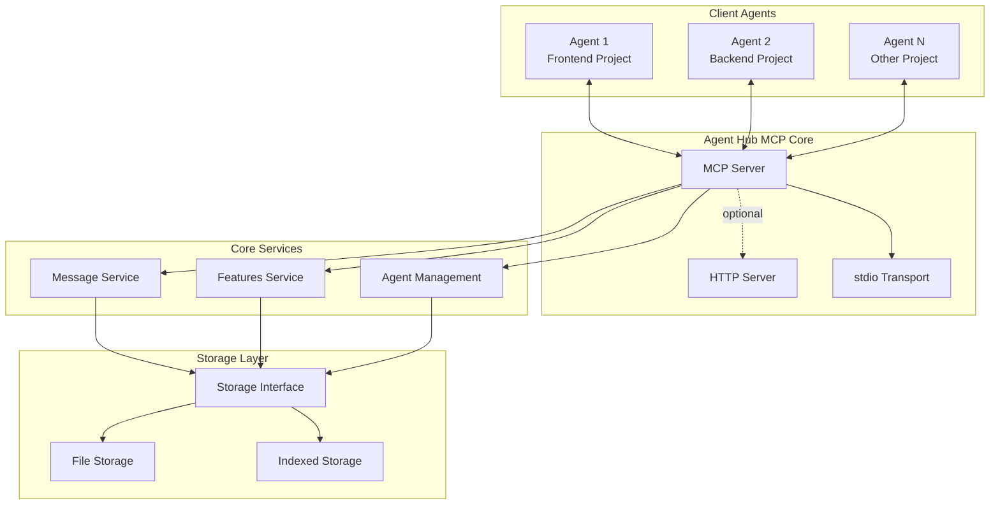
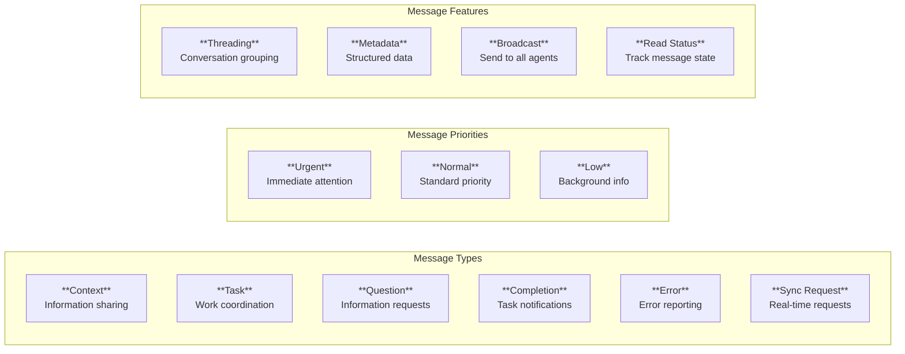
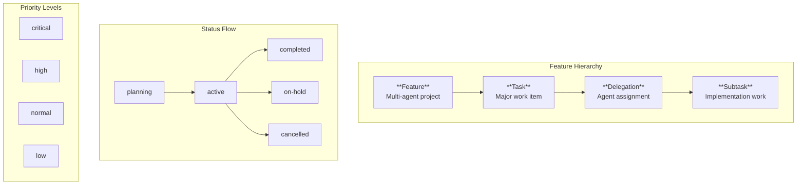
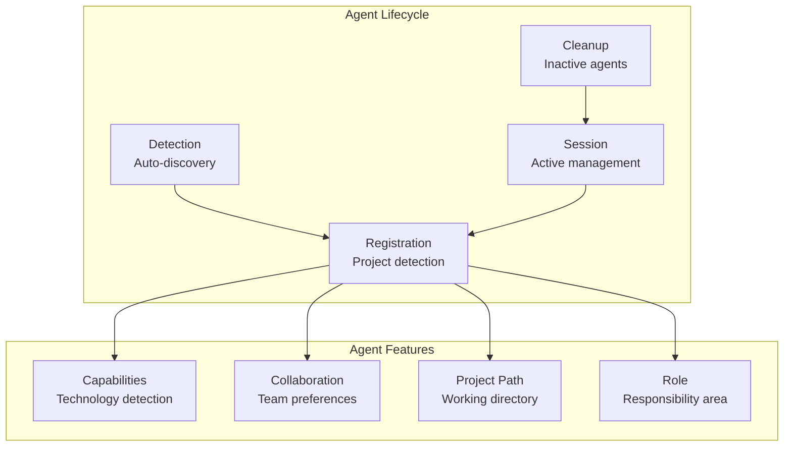
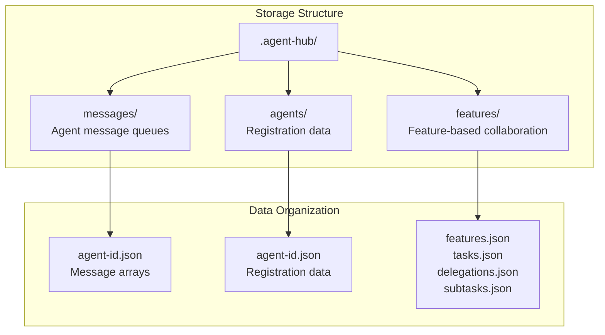
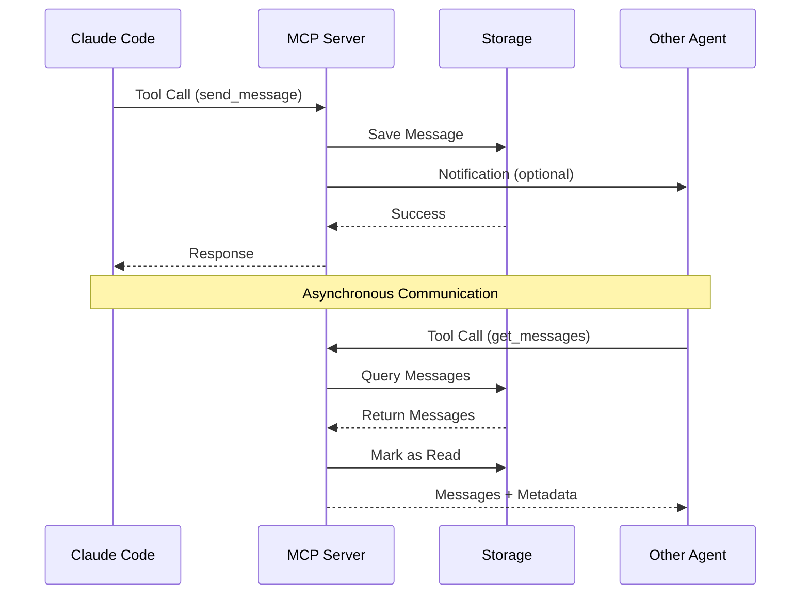
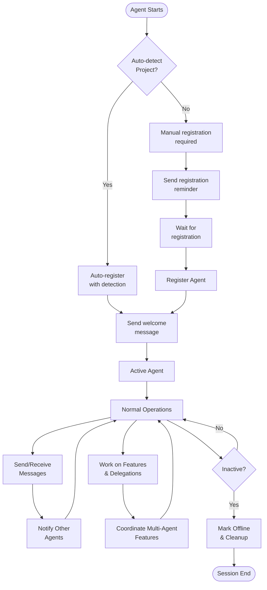
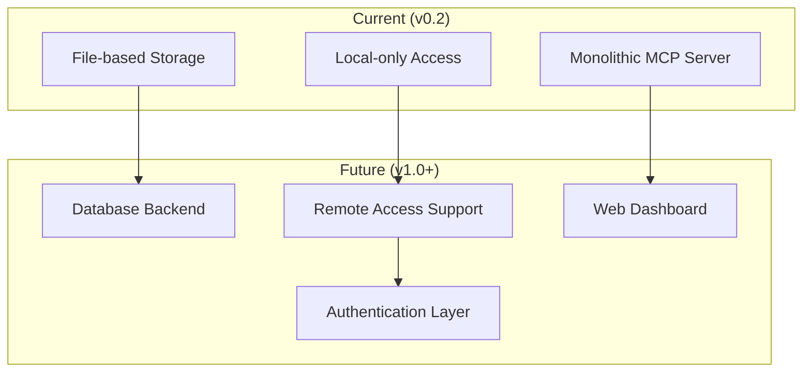

# Agent Hub MCP - System Overview

This document provides a comprehensive overview of the Agent Hub MCP architecture, components, and their interactions.

## System Architecture

The Agent Hub MCP is a multi-agent coordination system that enables communication, context sharing, and task coordination between multiple Claude Code agents working across different projects.



## Core Components

### 1. MCP Server (src/servers/mcp.ts)

The Model Context Protocol server that handles tool calls and resource management.

**Key Responsibilities:**
- Process MCP tool requests
- Manage agent sessions
- Handle resource subscriptions
- Coordinate with core services

**Features:**

- Auto-agent registration detection
- Session management
- Resource change notifications
- Tool validation and error handling

### 2. Message Service (src/messaging/service.ts)

Handles inter-agent communication, supporting various message types and priorities.



**Key Methods:**

- `sendMessage()` - Send messages between agents
- `getMessages()` - Retrieve messages with filtering

### 3. Features Service (src/features/service.ts)

Coordinates multi-agent collaboration through feature-based project organization.



**Key Features:**
- **Multi-Feature Support**: Agents work across multiple active features
- **Priority Management**: Critical features take precedence
- **Context Isolation**: Each feature maintains its own scope
- **Load Distribution**: Work distributes naturally across available agents
- **Dependency Tracking**: Agents can see what others are working on within features

**Core Methods:**
- `createFeature()` - Start new multi-agent project
- `createTask()` - Break features into delegated work
- `getAgentWorkload()` - Get all agent assignments across features
- `updateSubtask()` - Track implementation progress

### 5. Agent Management (src/agents/)

Handles agent detection, service, and lifecycle management.



**Key Components:**
- **Detection** (`detection.ts`) - Auto-detect project capabilities  
- **Session** (`session.ts`) - Active agent session management
- **Cleanup** (`cleanup.ts`) - Remove inactive agents

## Storage Layer

The system supports two storage implementations:

### File Storage (src/storage/file-storage.ts)
- **Direct file system operations** - No caching layer for multi-instance reliability
- **Simple JSON serialization** - Human-readable storage format
- **Directory-based organization** - Logical separation of data types
- **Atomic write operations** - Prevents data corruption during writes
- **Cross-platform paths** - Works on Windows, macOS, Linux
- **File permissions** - Secure storage directory access (755)



## Transport Options

### 1. stdio Transport (Primary)
- Process-based communication
- Direct MCP integration
- Manual agent registration required
- Best for local development and production
- Multi-instance.

### 2. HTTP Transport (Development/Debug)
- RESTful API with Server-Sent Events
- Browser-compatible debugging
- Auto-discovery and session management 
- Web dashboard capabilities



## Communication Patterns

### 1. Asynchronous Messaging
- Agents send messages to queues
- Recipients poll for new messages
- Supports threading and metadata
- Persistent delivery guaranteed

### 2. Feature-Based Coordination
- Multi-agent projects with clear scope
- Task delegation with specific assignments
- Progress tracking through subtasks
- Context sharing within feature boundaries

### 3. Task Coordination
- Dependency tracking
- Status updates
- Progress monitoring
- Collaboration initialization

## Data Flow



## Security & Validation

The system includes security measures:

- **Input Validation** (`src/validation/`) - Schema validation for all inputs
- **Path Security** - Prevents directory traversal attacks
- **CORS Restrictions** - HTTP server limited to localhost
- **Rate Limiting** - Prevents abuse of HTTP endpoints
- **File Permissions** - Secure storage directory access

## Performance Considerations

### Indexed Storage Benefits:
- **In-Memory Caching** - Fast repeated queries
- **Index Optimization** - Efficient filtering  
- **Batch Operations** - Reduced I/O overhead
- **Cache Statistics** - Performance monitoring

### Scalability Limits:
- **File-based Storage** - Not suitable for high concurrency
- **Memory Usage** - Context data kept in memory
- **Concurrent Access** - File locking may cause delays

## Integration Points

### MCP Client Integration:
```json
{
  "mcpServers": {
    "agent-hub": {
      "command": "node",
      "args": ["/path/to/agent-hub-mcp/dist/index.js"],
      "env": {
        "AGENT_HUB_DATA_DIR": "/path/to/.agent-hub"
      }
    }
  }
}
```

### Available MCP Tools:
- `register_agent` - Agent registration and reconnection
- `send_message` - Inter-agent communication
- `get_messages` - Message retrieval
- `get_hub_status` - Hub activity monitoring
- `create_feature` - Start multi-agent projects
- `create_task` - Break features into delegated work
- `create_subtask` - Track implementation steps
- `accept_delegation` - Accept assigned work
- `update_subtask` - Report progress
- `get_agent_workload` - View assigned work
- `get_features` - List features with filtering
- `get_feature` - Get complete feature data

## Monitoring & Debugging

### File System Monitoring:
```bash
# Monitor storage directory
ls -la ~/.agent-hub/
ls -la ~/.agent-hub/messages/    # Agent message queues
ls -la ~/.agent-hub/agents/      # Agent registrations  
ls -la ~/.agent-hub/features/    # Feature collaboration data

# Storage directory structure:
# .agent-hub/
# ├── messages/           # Individual agent message files
# │   ├── agent-1.json   
# │   └── agent-2.json
# ├── agents/            # Agent registration files
# │   ├── agent-1.json
# │   └── agent-2.json
# └── features/          # Feature-based collaboration
#     ├── feature-123/
#     │   ├── feature.json
#     │   ├── tasks.json
#     │   └── delegations.json
#     └── feature-456/
```

### HTTP Dashboard (Development):
```bash
pnpm run dev  # Start HTTP server on port 3737
```

### Debug Logging:
```bash
DEBUG=agent-hub:* node dist/index.js
```

## Future Architecture Considerations

### Planned Enhancements:
- **Database Backend** - Replace file storage for high-volume scenarios
- **Web Dashboard** - Real-time monitoring interface
- **Authentication** - Multi-user and remote access support
- **Streaming APIs** - Real-time event streaming
- **Microservice Split** - Separate services for different concerns

### Architecture Evolution:


This architecture provides a solid foundation for multi-agent collaboration while maintaining simplicity and reliability for local development scenarios.
